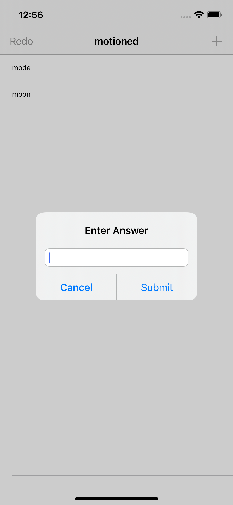

# Porjects 5: Word Scramble
Hacking with swift project 5: Word Scramble.

# Menu
* [Screenshot](#screenshot)
* [What's New](#what's-new)
* [Source](#source)
* [Contributions](#contributions)
* [Contact](#contact)

# Sceenshot

## What's New

* self.tableView.insertRows(at: [indexPath], with: .automatic)
* func firstIndex(of element: Self.Element) -> Self.Index?
* UITextChecker()
* NSRange(location: 0, length: word.utf16.count)
* UITextChecker().rangeOfMisspelledWord(in: word, range: range, startingAt: 0, wrap: false, language: "en")
* .components(separatedBy: "\n")

# Source
Courcess: [Hacking With Swift](https://twitter.com/twostraws).

# Contributions

* All kinds of contributions (enhancements, new features, documentation & code improvements, issues & bugs reporting & todo task) are welcome. Let's make it better.

# Contact
Created by [Terry Kuo](https://twitter.com/ArgonYoYo) - feel free to contact me!
